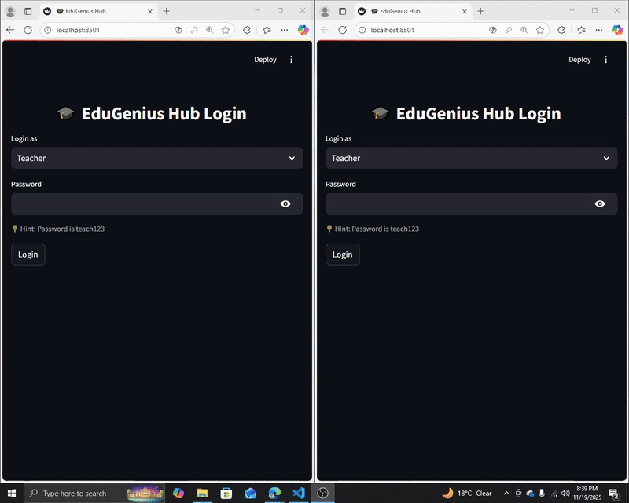
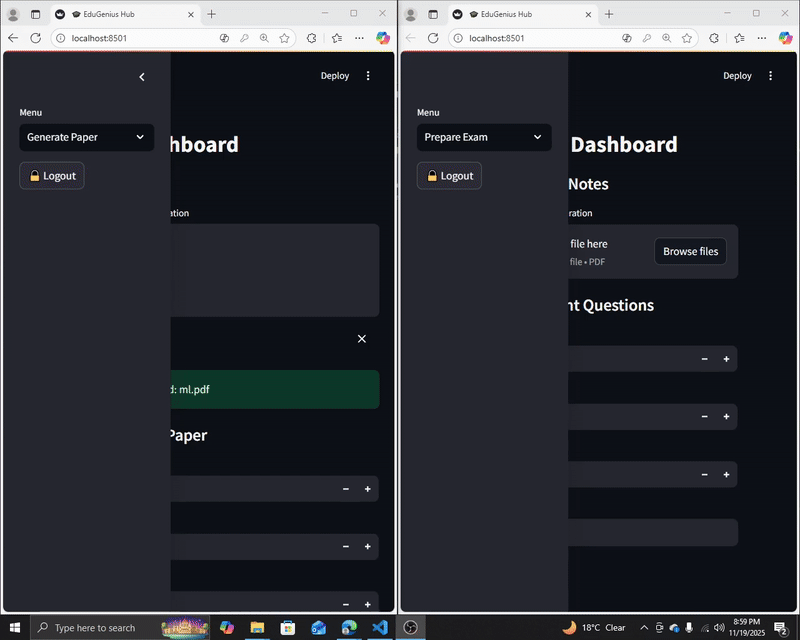
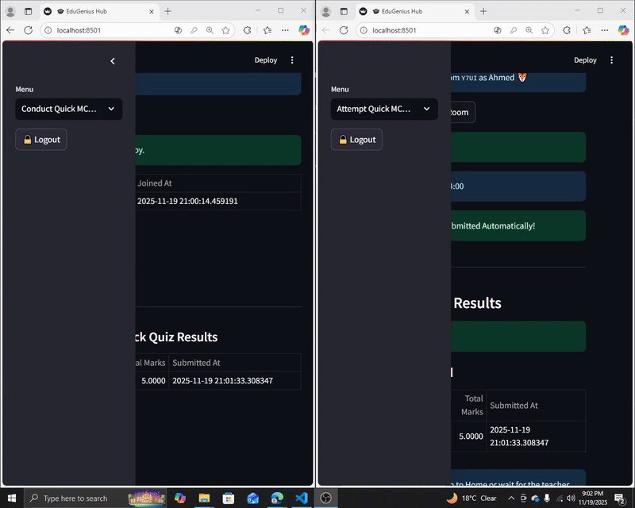
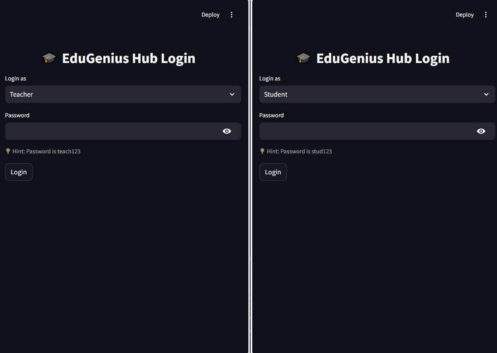
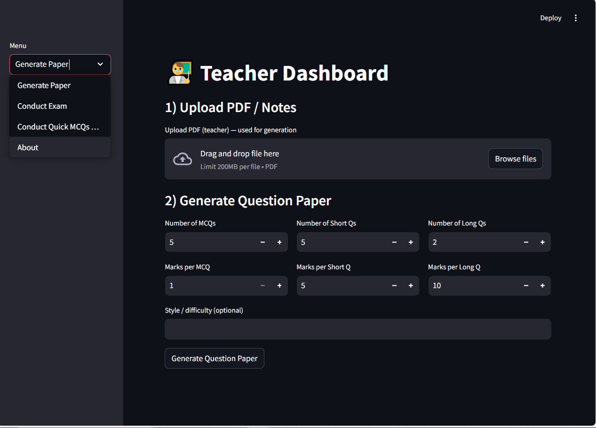

---

# 🎓 Smart Exam & Quick Quiz Platform
       
## **1. Login**  
  
## **2. Generate Exam paper Solved/Unsolved**  
  
## **3. Conduct and Attempt Exam**      
  
## **4. Conduct and Attempt Quick MCQs Test**        

## **5. About**     


> **AI-Powered Exam Generation & Real-Time Student Quizzes: Transforming Education with LLMs & Generative AI!**

---

## 📱 App Features: Transforming Education with AI

### **1. AI-Powered Exam Generation**

* Convert any **PDF or notes** into a fully structured exam paper using **Generative AI**.
* Supports **MCQs, Short Answers, and Long Answers**.
* Optional **difficulty/style parameters** to customize question generation.
* Powered by **LLMs** that understand content context and create meaningful questions.

### **2. Live Exam Rooms**

* Teachers can **create rooms**, set **time limits**, and start exams in real-time.
* Students join using a **room code** and participate instantly.
* **Countdown timers** & **auto-submission** ensure smooth, monitored exams.
* Teachers can **view results immediately**, no extra steps for leaderboards.

### **3. Quick MCQ Quiz Mode**

* **Step-by-step quiz interface** for fast practice sessions.
* Live **score tracking** for students.
* **Auto-submit & auto-finish** on timeout.
* Real-time exam **progress indicators** and timers.

### **4. Downloadable Exam Papers**

* Export generated exams in **PDF or DOCX** formats.
* Both **question-only** and **solved papers** are available for reference.
* Students can **study offline** with instant downloads.

### **5. Interactive & Modern UI**

* Optimized for **mobile and desktop**.
* Dynamic dashboards for **teachers and students**.
* Real-time updates using **auto-refresh & session management**.

---

## 🎬 Demo Preview

| Home Screen                   | Teacher Dashboard                      | Student Dashboard                 | 
| ----------------------------- | -------------------------------------- | --------------------------------- |  
|  |  |  | 

---

## 🛠️ Tech Stack & Tools

* **Backend / Logic**: Python, Pandas, JSON
* **Web App**: Streamlit (Fast & Interactive UI)
* **Generative AI**: LLMs for **question generation** and **smart MCQ creation**
* **File Handling**: PDF extraction & DOCX/PDF export
* **Data Storage**: CSVs for rooms, participants, and results
* **Randomized Avatars & Session Management** for a **fun interactive experience**

---

## 💡 Why This App is Cutting-Edge

* Uses **Generative AI & LLMs** to automate tedious exam creation.
* Provides **real-time monitoring & instant results** for teachers.
* Delivers **student engagement** with dynamic quizzes and live feedback.
* **Portable, lightweight, and scalable** — works on web or mobile.
* Perfect for **showcasing AI, Python, and Data-Driven Engineering skills** to recruiters.

---

## 📂 Installation & Usage

1. **Clone the repository**

```bash
git clone https://github.com/UsamaMunawarr/Smart-Exam-Quick-Quiz.git
cd Smart-Exam-Quick-Quiz
```

2. **Create a virtual environment & install dependencies**

```bash
python -m venv venv
source venv/bin/activate  # On Windows: venv\Scripts\activate
pip install -r requirements.txt
```

3. **Run the app**

```bash
streamlit run app.py
```

4. **Upload PDFs**, generate AI-powered questions, and enjoy **real-time quizzes**!

---

## 🙌 Author & Connect

<p style="color:blue; font-size: 24px; font-weight: bold;">Usama Munawar</p>  

[](https://github.com/UsamaMunawarr)[](https://www.linkedin.com/in/abu--usama)[](https://www.youtube.com/@CodeBaseStats)[](https://twitter.com/Usama__Munawar)[](https://www.facebook.com/profile.php?id=100005320726463)

> Thank you for exploring this project! Share & demo it to showcase **AI, LLMs, and real-time web app expertise**. 😇


